# SRE Platform on Amazon EKS
Amazon EKS上に構築した、Production運用を想定したSRE / DevOpsプラットフォームです。

Google Online Boutiqueの[fork](https://github.com/ryuichimatsuyama/microservices-demo)をWorkloadとして利用し、Infrastructure Provisioning、CI/CD、GitOps、Progressive Delivery、Observability、SLO-based Alerting、Incident ResponseまでをEnd-to-Endで実装しています。

---

## Architecture

```mermaid
flowchart TB

    %% =========================================================
    %% External
    %% =========================================================

    USER["Users"]
    CF["Cloudflare<br/>WAF / Rate Limiting"]
    PD["PagerDuty<br/>Incident Management"]

    USER -->|HTTPS| CF


    %% =========================================================
    %% CI/CD & Artifact Management
    %% =========================================================

    subgraph CICD["CI/CD & Artifact Management"]
        direction TB

        APP_PR["Application PR<br/>Source Validation"]

        PR_CI["GitHub Actions<br/>
        Build / Test / Trivy<br/>
        PR Environment / E2E"]

        MAIN["GitHub<br/>main"]

        BUILD["GitHub Actions<br/>
        Build / Push"]

        GHCR["GHCR<br/>Container Images"]

        RENOVATE["Renovate<br/>Artifact Promotion"]

        RENOVATE_PR["Renovate PR<br/>
        Artifact Validation"]

        APP_PR -->|Trigger| PR_CI
        PR_CI -->|Required Checks| APP_PR
        APP_PR -->|Merge| MAIN

        MAIN -->|Trigger| BUILD
        BUILD -->|Push Image| GHCR

        GHCR --> RENOVATE
        RENOVATE -->|Image Tag Update| RENOVATE_PR
        RENOVATE_PR -->|Merge| MAIN
    end


    %% =========================================================
    %% Infrastructure & Platform Configuration as Code
    %% =========================================================

    subgraph IAC["Infrastructure & Platform Configuration as Code"]
        direction TB

        TF["Terraform"]

        subgraph TF_TARGETS["Managed Infrastructure"]
            direction LR

            TF_AWS["AWS<br/>VPC / EKS / IAM"]

            TF_GITHUB["GitHub<br/>
            Apps / Branch Protection"]

            TF_CF["Cloudflare<br/>
            DNS / Tunnel / WAF"]

            TF_PD["PagerDuty<br/>
            Services / Policies"]
        end

        TF --> TF_AWS
        TF --> TF_GITHUB
        TF --> TF_CF
        TF --> TF_PD
    end


    %% =========================================================
    %% AWS
    %% =========================================================

    subgraph AWS["AWS — ap-northeast-1"]
        direction TB

        subgraph VPC["VPC — 10.0.0.0/16"]
            direction TB

            subgraph SUBNETS["Private Subnets — 3 Availability Zones"]
                direction LR

                AZ1["AZ 1<br/>10.0.0.0/20"]
                AZ2["AZ 2<br/>10.0.16.0/20"]
                AZ3["AZ 3<br/>10.0.32.0/20"]
            end


            subgraph EKS["Amazon EKS"]
                direction TB

                ARGO["Argo CD<br/>GitOps Controller"]

                APPSET["ApplicationSet<br/>
                PR Environments"]

                subgraph GITOPS["GitOps Managed Resources"]
                    direction TB


                    %% -----------------------------------------
                    %% Application & Progressive Delivery
                    %% -----------------------------------------

                    subgraph APP_DELIVERY["Application & Progressive Delivery"]
                        direction LR

                        subgraph APPLICATION["Application"]
                            direction TB

                            APP["Online Boutique<br/>
                            11 Microservices"]

                            PREVIEW["PR Environments"]
                        end

                        subgraph DELIVERY["Progressive Delivery"]
                            direction TB

                            ROLLOUTS["Argo Rollouts<br/>
                            Canary 20% → 50% → 100%"]
                        end
                    end


                    %% -----------------------------------------
                    %% Networking & Service Mesh
                    %% -----------------------------------------

                    subgraph NETWORKING["Networking & Service Mesh"]
                        direction LR

                        TUNNEL["cloudflared<br/>
                        Cloudflare Tunnel"]

                        ISTIO["Istio<br/>
                        STRICT mTLS<br/>
                        Canary Traffic Splitting"]
                    end


                    %% -----------------------------------------
                    %% Observability
                    %% -----------------------------------------

                    subgraph OBS["Observability & Reliability"]
                        direction TB

                        PROM["Prometheus / Sloth<br/>
                        Metrics / SLI / SLO<br/>
                        Error Budget / Burn Rate"]

                        subgraph OBS_TOOLS["Telemetry & Visualization"]
                            direction LR

                            GRAFANA["Grafana<br/>
                            Dashboards"]

                            LOKI["Loki / Promtail<br/>
                            Logs"]

                            OTEL["OpenTelemetry<br/>
                            Telemetry"]

                            JAEGER["Jaeger<br/>
                            Distributed Tracing"]

                            ALERT["Alertmanager<br/>
                            Alert Routing"]
                        end
                    end
                end
            end
        end
    end


    %% =========================================================
    %% Layout Guidance
    %% =========================================================

    BUILD ~~~ TF
    TF_AWS ~~~ AZ2
    AZ2 ~~~ ARGO


    %% =========================================================
    %% Terraform -> Infrastructure
    %% =========================================================

    TF_AWS -.->|Provision| AZ2
    TF_AWS -.->|Bootstrap Argo CD| ARGO


    %% =========================================================
    %% GitOps Desired State
    %% =========================================================

    MAIN -->|Stable Desired State| ARGO

    APP_PR -->|PR Desired State| APPSET
    RENOVATE_PR -->|Release Desired State| APPSET

    APPSET -->|Generate PR Applications| PREVIEW

    ARGO -->|Reconcile| GITOPS


    %% =========================================================
    %% Progressive Delivery
    %% =========================================================

    ROLLOUTS -->|Canary| APP

    PROM -->|SLO / Burn Rate| ROLLOUTS


    %% =========================================================
    %% Observability
    %% =========================================================

    APP -->|Metrics| PROM
    APP -->|Logs| LOKI
    APP -->|Telemetry| OTEL

    PROM -->|Metrics| GRAFANA
    PROM -->|Alerts| ALERT

    LOKI -->|Logs| GRAFANA

    OTEL -->|Traces| JAEGER
    JAEGER -->|Traces| GRAFANA

    ALERT -->|Page| PD


    %% =========================================================
    %% External Traffic
    %% =========================================================

    TUNNEL -->|Outbound Tunnel| CF
    CF -.->|Request through Tunnel| TUNNEL
    TUNNEL -->|Origin Traffic| APP
```

---

## Components

| Component | Role | Implementation |
|---|---|---|
| **Amazon EKS** | Kubernetes Platform | Online BoutiqueとSRE Platform Componentsを実行。VPC内の3 Availability Zonesに配置したPrivate Subnetを利用 |
| **Terraform** | Infrastructure & Configuration as Code | AWS / GitHub / Cloudflare / PagerDutyをCodeとして管理し、Argo CDを初期Bootstrap |
| **GitHub** | Source of Truth | Application Code / Kubernetes Desired State / Pull Requestを管理 |
| **GitHub Actions** | CI / Change Validation | Build・Test・Trivy Scan・Manifest Validationを実行し、PR Environment上でHealth Check / E2Eを実施 |
| **Docker Buildx Bake** | Container Build | Online Boutiqueの11 Microservicesを並列Build |
| **GHCR** | Container Registry | PR ImageおよびRelease Imageを保存 |
| **Renovate** | Artifact Promotion | 新しいRelease Imageを検出し、各Microserviceを同一Release Tagへ更新するPromotion PRを作成 |
| **Argo CD** | GitOps | GitをSource of TruthとしてKubernetes Desired Stateを継続的にReconcile。Configuration Driftを検出・修正 |
| **ApplicationSet** | PR Environments | Application PR / Renovate PRごとにPR環境を生成し、各PRのrevisionをデプロイ |
| **Argo Rollouts** | Progressive Delivery | Canaryを`20% → 50% → 100%`で段階的にRelease。アラート発生時はRolloutをAbort。|
| **Istio** | Service Mesh | カナリアリリースのトラフィック分割 / メトリクス収集 |
| **Prometheus** | Metrics | Metricsを収集し、SLI / SLO / Error Budget / Burn Rateを評価 |
| **Sloth** | SLO | Availability SLO `99.9%`を定義し、Alert Rulesを生成。|
| **Grafana** | Visualization | Metrics・SLI / SLO・Error Budget・Burn RateをDashboardで可視化。|
| **Loki / Promtail** | Logging | Logsを収集。|
| **OpenTelemetry** | Telemetry | Telemetryを収集。 |
| **Jaeger** | Distributed Tracing | Microservices間のRequest Flowを追跡し、Latency / Errorの発生箇所を調査。|
| **Alertmanager** | Alert Routing | Slothが生成したSLOアラートのうち、`sloth_severity="page"` をPagerDutyへルーティング |
| **PagerDuty** | Incident Management | `sloth_severity="page"` のSLOアラートをインシデント化し、オンコール担当者へ通知|
| **Trivy** | Security | CIでContainer Imageの脆弱性Scanを実行 |
| **Cloudflare Tunnel** | External Access | EKS内の`cloudflared`からCloudflareへOutbound Tunnelを確立し、Applicationを公開 |
| **Cloudflare WAF / Rate Limiting** | Edge Security | External RequestをEdgeで検査し、不正Requestや過剰Requestを制御 |
